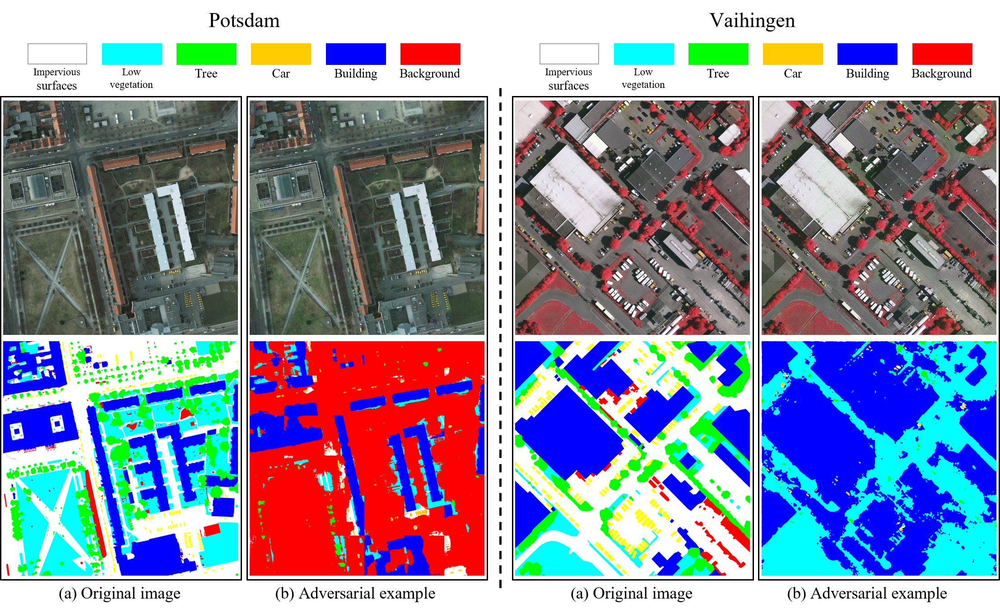

# CLARS: Contrastive Learning Attack for Remote Sensing

Contrastive Learning Attack for Remote Sensing


## Installation

- Open the folder **CLARS** using **Linux Terminal** and create python environment:

```
conda create -n clars python=3.9
conda activate clars
pip3 install torch torchvision torchaudio --index-url https://download.pytorch.org/whl/cu118
pip install packaging
pip install triton
pip install timm
pip install scikit-learn matplotlib scikit-image tqdm
```

## Contrastive Learning Attack Data Set (CLADS)

We have integrated the adversarial examples generated by our proposed black-box attack method into a dataset named Contrastive Learning Attack Data Set (CLADS) due to its high attack success rate across neural networks with different internal structures and frameworks. For the scene classification task, CLADS contains a total of $15,545$ images with $224 \times 224$ resolution, including $9,495$ samples from the RESISC45 dataset, $1,050$ samples from the UC Merced dataset, and $5,000$ samples from the AID dataset. For the semantic segmentation task, CLADS includes $31$ high-resolution images, $14$ from the Potsdam dataset and $17$ from the Vaihingen dataset. We hope that the CLADS dataset can serve as a benchmark or adversarial training strategy for advancing the development of safer and more robust remote sensing models in future applications.

📡 **Download links:** **[One Drive](https://1drv.ms/u/c/81fe299a3e84798b/ERb8ooon6ZZPgWwB9T61dEEBVD5QI6LiSKEcv__KoWFQOQ?e=hoPNT7)**    **[Quark NetDisk](https://pan.quark.cn/s/9ad73b105951)** (Code: qqke)


​	Adversarial examples (all odd columns) generated by the CLARS and corresponding examples of clean images (all even columns) in the UCM dataset.



​	The semantic segmentation results of the victim model under black-box attacks (CLARS) on the Potsdam and Vaihingen datasets are presented.

## Dataset Preparation

### Remote Sensing Image Classification Dataset

We provide the method of preparing the remote sensing image classification dataset used in the paper.

#### UC Merced Dataset

- Image and annotation download link: [UC Merced Dataset](http://weegee.vision.ucmerced.edu/datasets/landuse.html).

#### AID Dataset

- Image and annotation download link: [AID Dataset](https://www.kaggle.com/datasets/jiayuanchengala/aid-scene-classification-datasets).

#### NWPU RESISC45 Dataset

- Image and annotation download link: [NWPU RESISC45 Dataset](https://aistudio.baidu.com/datasetdetail/220767).

#### Organization Method

You can also choose other sources to download the data, but you need to organize the dataset in the following format：

```
├── <THE-ROOT-PATH-OF-DATA>/ # Dataset root directory, for example: /home/workspace/CLARS/data
│   ├── UCMerced_LandUse/     
|   |   ├── Images/
|   |   |   ├── agricultural/
|   |   |   ├── airplane/
|   |   |   |── ...
│   ├── AID/     
|   |   ├── Airport/
|   |   ├── BareLand/
|   |   |── ...
│   ├── NUPU_RESISC45/     
|   |   ├── ...
|   |   ├── ...
```

Note: In the project folder `data`, we provide the data set partition file `dataset_name.txt`. You can also use the Python script to divide the data set.

### Remote Sensing Image Segmentation Dataset

We provide the method of preparing the remote sensing image segmentation dataset used in the paper.

Supported Remote Sensing Datasets

#### ISPRS Vaihingen

- Image and annotation download link: [ISPRS Vaihingen Dataset](https://www.isprs.org/education/benchmarks/UrbanSemLab/default.aspx).

#### ISPRS Potsdam

- Image and annotation download link: [ISPRS Potsdam Dataset](https://www.isprs.org/education/benchmarks/UrbanSemLab/default.aspx).

```none
├── data
│   ├── vaihingen
│   │   ├── train_images (original)
│   │   ├── train_masks (original)
│   │   ├── test_images (original)
│   │   ├── test_masks (original)
│   │   ├── test_masks_eroded (original)
│   │   ├── train (processed)
│   │   ├── test (processed)
│   ├── potsdam (the same with vaihingen)
```


### Adversarial attacks on image classification

- Generate adversarial examples:

```
python clars_cls.py --surrogate_model 'resnet18' \
                    --dataID 1 \
                    --save_prefix <THE-ROOT-PATH-OF-DATA> \
                    --batch_size 8
```

- Performance evaluation on the adversarial test set:

```
python pred_cls.py --dataID 1 \
		   --victim_model 'resnet18' \
                   --data_path <THE-ROOT-PATH-OF-DATA> \
                   --batch_size 8
```

## License

This project is licensed under the [Apache 2.0 License](https://github.com/iamk1ko/CLARS/blob/main/LICENSE).
