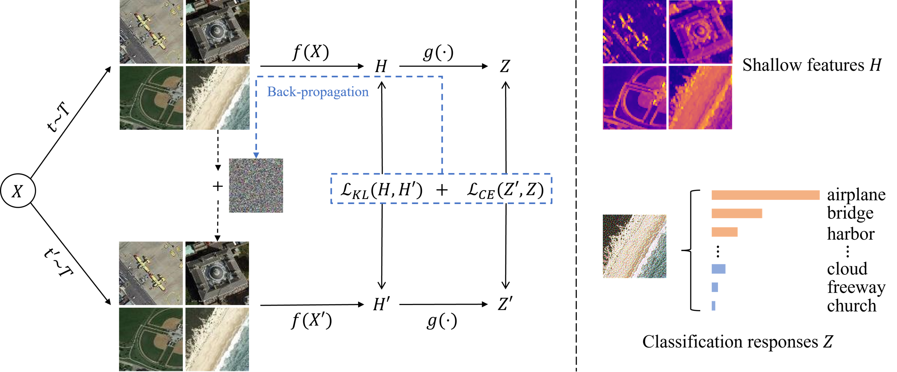

# CLARS: Contrastive Learning Attack for Remote Sensing

Contrastive Learning Attack for Remote Sensing




## Installation

- Open the folder **CLARS** using **Linux Terminal** and create python environment:

```
conda create -n clars python=3.9
conda activate clars
pip3 install torch torchvision torchaudio --index-url https://download.pytorch.org/whl/cu118
pip install tqdm
```

## Dataset Preparation

### Remote Sensing Image Classification Dataset

We provide the method of preparing the remote sensing image classification dataset used in the paper.

#### UC Merced Dataset

- Image and annotation download link: [UC Merced Dataset](http://weegee.vision.ucmerced.edu/datasets/landuse.html).

#### AID Dataset

- Image and annotation download link: [AID Dataset](https://www.kaggle.com/datasets/jiayuanchengala/aid-scene-classification-datasets).

#### NWPU RESISC45 Dataset

- Image and annotation download link: [NWPU RESISC45 Dataset](https://aistudio.baidu.com/datasetdetail/220767).

#### Organization Method

You can also choose other sources to download the data, but you need to organize the dataset in the following format：

```
├── <THE-ROOT-PATH-OF-DATA>/ # Dataset root directory, for example: /home/workspace/CLARS/data
│   ├── UCMerced_LandUse/     
|   |   ├── Images/
|   |   |   ├── agricultural/
|   |   |   ├── airplane/
|   |   |   |── ...
│   ├── AID/     
|   |   ├── Airport/
|   |   ├── BareLand/
|   |   |── ...
│   ├── NUPU_RESISC45/     
|   |   ├── ...
|   |   ├── ...
```

Note: In the project folder `data`, we provide the data set partition file `dataset_name.txt`. You can also use the Python script to divide the data set.

### Remote Sensing Image Segmentation Dataset

We provide the method of preparing the remote sensing image segmentation dataset used in the paper.

Supported Remote Sensing Datasets

#### ISPRS Vaihingen

- Image and annotation download link: [ISPRS Vaihingen Dataset](https://www.isprs.org/education/benchmarks/UrbanSemLab/default.aspx).

#### ISPRS Potsdam

- Image and annotation download link: [ISPRS Potsdam Dataset](https://www.isprs.org/education/benchmarks/UrbanSemLab/default.aspx).

```none
├── data
│   ├── vaihingen
│   │   ├── train_images (original)
│   │   ├── train_masks (original)
│   │   ├── test_images (original)
│   │   ├── test_masks (original)
│   │   ├── test_masks_eroded (original)
│   │   ├── train (processed)
│   │   ├── test (processed)
│   ├── potsdam (the same with vaihingen)
```
